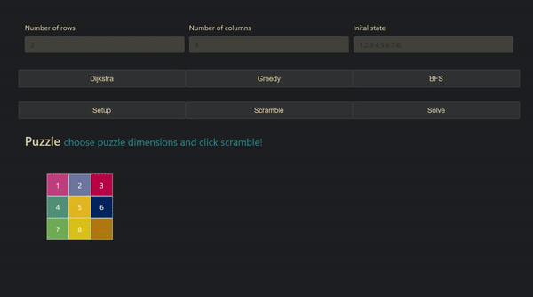
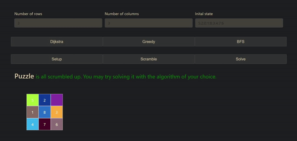
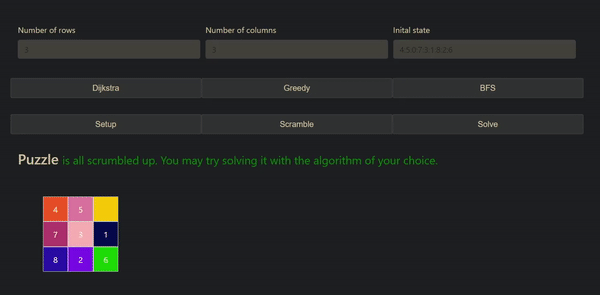
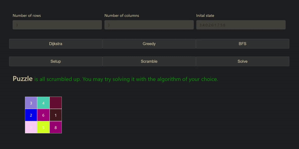

# Lloyds-Puzzle-Solver
Visualizer and solver for (hopefully) arbitrary puzzle size

This program is written in pure JavaScript, for now. I plan on implementing server-side solving because the scripts blocks the webpage for larger sizes

Next in line for implementation are A* and implementation of a genetic algorithm for solving this

## IN ACTION
### [Live Demo](https://rentorious.github.io/Lloyds-Puzzle-Solver/)
### Scambling the puzzle

### Dijstra solver

### BFS

### Gredy solver

